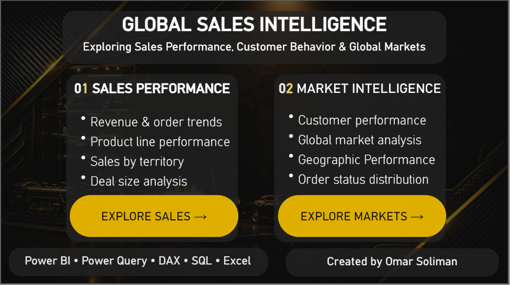
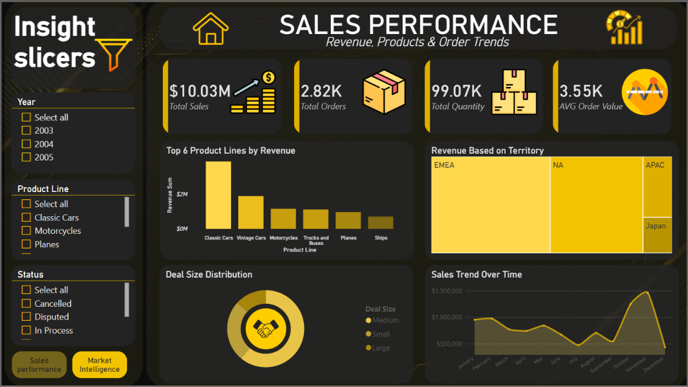
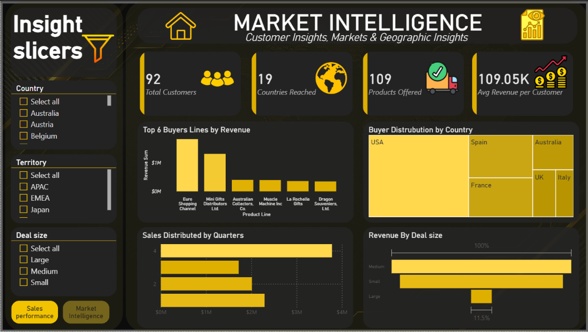

# Global Sales Intelligence Dashboard

Created by **Omar Soliman**, this portfolio project presents an executive-level Power BI experience for global sales analysis. The dashboard is designed to support fast navigation, performance monitoring, and market-level intelligence across products, customers, and geographies.

## Tech Stack

- **Power BI**
- **Power Query**
- **DAX**
- **SQL**
- **Excel**

## Core High-Level Metrics

- **Total Sales:** **$10.03M**
- **Total Orders:** **2.82K**
- **Average Order Value (AOV):** **$3.55K**
- **Total Customers:** **92**
- **Countries Covered:** **19**
- **Average Revenue per Customer:** **$109.05K**

## Dashboard Pages

### 1) Landing Navigation Portal

The opening portal provides structured navigation to all analytics modules and gives users a clear starting point for either operational sales review or strategic market analysis.

### 2) Sales Performance Module

This module focuses on operational sales execution and trend monitoring:

- **Product Line Performance:** **Classic Cars** leads all product lines.
- **Territory Composition (Treemap):** Revenue concentration is strongest across **EMEA** and **North America (NA)**.
- **Monthly Seasonality (Line Chart):** Sales peak in **November**, highlighting end-of-year demand acceleration.

### 3) Market Intelligence Module

This module supports customer and geographic strategy decisions:

- **Top Buyers:** Led by **Euro Shopping Channel**.
- **Country Contribution (Treemap):** Top contributors include the **USA**, **Spain**, and **France**.
- **Q4 Revenue Split:** Comparative quarter-end analysis surfaces regional/customer concentration patterns for final-quarter planning.

